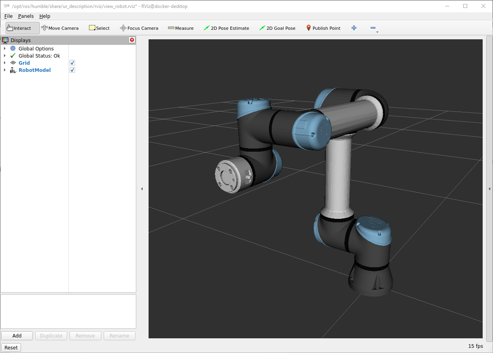

# UR5e Kinematics Control

This document describes how to create and use a simple ROS 2 package that provides **forward kinematics** for a **UR5e** robot

The package contains two nodes:

- `ur5e_joint_target` – you specify the 6 joint angles.
- `ur5e_joint_targets` – you specify the 6 joint angles for multiple waypoints.

## Joint Control

### Forward kinematics for 1 joint target

In a simulation environment:
- Run the UR driver:
  ```bash
  ros2 launch ur_robot_driver ur_control.launch.py ur_type:=ur5e robot_ip:=192.168.1.4 use_fake_hardware:=true launch_rviz:=true
  ```
- Move the robot to a desired joint configuration: 
  ```bash
  ros2 launch ur5e_kinematics_control ur5e_joint_target.launch.py target_deg:="[-90.0, -90.0, -90.0, -180.0, -90.0, 90.0]" time_sec:=5.0 controller_topic:=/scaled_joint_trajectory_controller/joint_trajectory
  ```
  

In a real robot UR5e:
- Run the UR driver:
  ```bash
  ros2 launch ur_robot_driver ur_control.launch.py ur_type:=ur5e robot_ip:=192.168.1.4 launch_rviz:=false
  ```
- Move the robot to a desired joint configuration: 
  ```bash
  ros2 launch ur5e_kinematics_control ur5e_joint_target.launch.py target_deg:="[-90.0, -90.0, -90.0, -180.0, -90.0, 90.0]" time_sec:=5.0 controller_topic:=/scaled_joint_trajectory_controller/joint_trajectory
  ```

### Forward kinematics for multiple joint targets

An extension of the previous node allows to specify multiple joint targets (waypoints) and the time to reach each waypoint (the time is the accumulated time, not the time to execute each movement!).

In a real robot UR5e:
- Run the UR driver:
  ```bash
  ros2 launch ur_robot_driver ur_control.launch.py ur_type:=ur5e robot_ip:=192.168.1.4 launch_rviz:=false
  ```
- Move the robot to a desired joint configuration: 
  ```bash
  ros2 launch ur5e_kinematics_control ur5e_joint_targets.launch.py controller_topic:=/scaled_joint_trajectory_controller/joint_trajectory trajectory_file:=trajectory_handshake.yaml
  ```