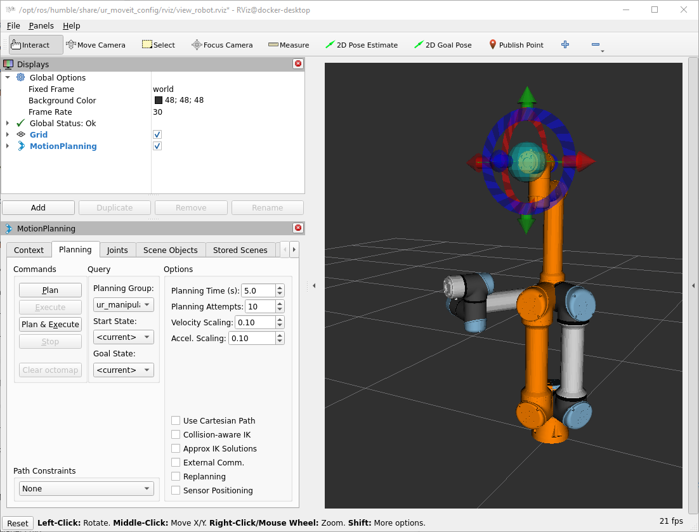
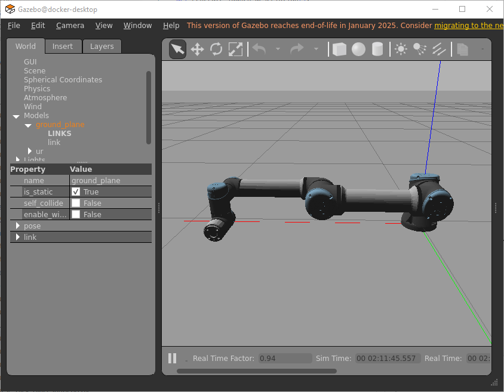
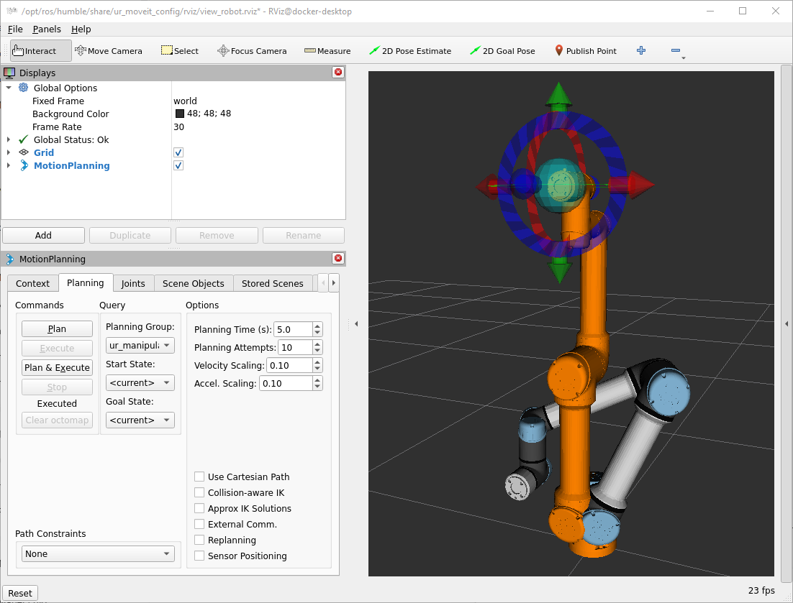

# UR5e Kinematics with MoveIt

This document describes how to create and use a simple ROS 2 package that provides **forward** and **inverse kinematics** tools for a **UR5e** robot using **MoveIt 2**.

The package contains two nodes:

- `ur5e_forward_kinematics_node` – you specify the 6 joint angles → it computes the end–effector pose.
- `ur5e_inverse_kinematics_node` – you specify a target pose (x, y, z, roll, pitch, yaw) → it computes one joint solution.
- `ur5e_move_to_pose` – you specify a target pose → it computes the joint solution and moves the robot.

Both nodes call the standard MoveIt services `/compute_fk` and `/compute_ik`, so **MoveIt’s `move_group` must be running** (e.g., via `ur_moveit_config`).


To properly work on UR5e robot manipulation moveit2 stack will be used. Moveit has some usefull APIs in python we can install:
- moveit_py
- pymoveit2

The official package is `moveit_py`, but `pymoveit2` is simpler and recommended for beginners.

## 1. Install `pymoveit` package

Basic Python interface for MoveIt 2 built on top of ROS 2 actions and services. (https://docs.ros.org/en/humble/p/pymoveit2/index.html
)

Instructions to install:
- Clone this repository, install dependencies and build with colcon.

    ```bash
    # Clone this repository into your favourite ROS 2 workspace
    git clone https://github.com/AndrejOrsula/pymoveit2.git
    # Install dependencies
    rosdep install -y -r -i --rosdistro ${ROS_DISTRO} --from-paths .
    # Build
    colcon build --merge-install --symlink-install --cmake-args "-DCMAKE_BUILD_TYPE=Release"
    ```
- Delete some folders to sync the ws on remote github
    ```bash
    cd ~/Desktop/UR5e_social_robotics/src/ur5e_motion/pymoveit2
    sudo rm -rf .git
    cd ~/Desktop/UR5e_social_robotics
    git rm --cached src/ur5e_motion/pymoveit2
    ```

## 2. Create the package

In your workspace:

```bash
cd ~/Desktop/UR5e_social_robotics/src

ros2 pkg create ur5e_kinematics_pymoveit2 --build-type ament_python
```

This creates a Python-based ROS 2 package.

**Build the workspace**

```bash
cd ~/Desktop/UR5e_social_robotics
colcon build
source install/setup.bash
```

### Forward kinematics

In a simulation environment:
- Run the UR driver:
  ```bash
  ros2 launch ur_robot_driver ur_control.launch.py ur_type:=ur5e robot_ip:=192.168.1.4 use_fake_hardware:=true launch_rviz:=false
  ````
- Run MoveIt:
  ```bash
  ros2 launch ur_moveit_config ur_moveit.launch.py ur_type:=ur5e launch_rviz:=true
  ```
- Move the robot to a desired joint configuration: 
  ```bash
  ros2 launch ur5e_kinematics_pymoveit2 ur5e_forward_kinematics.launch.py joints:="[1.0, -1.57, 1.57, -3.14, -1.57, 3.14]" execute:=true
  ```
  

Bringup Real UR5e robot with MoveIt:
  ```bash
  ros2 launch ur_robot_driver ur_control.launch.py ur_type:=ur5e robot_ip:=192.168.1.4 launch_rviz:=false
  ros2 launch ur_moveit_config ur_moveit.launch.py ur_type:=ur5e launch_rviz:=true
  ```
  > Proper controllers are automatically selected by `moveit_config` 

Compute FK and move for a given joint configuration:

```bash
ros2 launch ur5e_kinematics_pymoveit2 ur5e_forward_kinematics.launch.py joints:="[1.0, -1.57, 1.57, -3.14, -1.57, 3.14]" execute:=true
```

### Inverse kinematics

It is important to note that:
- POSE in roboDK is referenced to `table` frame
- POSE in ROS2 (Gazebo) is referenced to `base_link` frame


> This POSE corresponds to `zero_angle` in our Real robot ur5e paltform

UR robots have `base_link` frame 180 deg from `table` frame, then:
````python
x_ros  = -x_robodk
y_ros  = -y_robodk
z_ros  =  z_robodk

roll_ros = roll_robodk
pitch_ros = pitch_robodk
yaw_ros ≈ yaw_robodk + π
````
**This has been taken into account in:**
- the python node `ur5e_move_to_pose_table.py` and 
- the `ur5e_move_to_pose_table.launch.py` launch file

In a **simulation** environment:
  ```bash
  ros2 launch ur_robot_driver ur_control.launch.py ur_type:=ur5e robot_ip:=192.168.1.4 use_fake_hardware:=true launch_rviz:=false

  ros2 launch ur_moveit_config ur_moveit.launch.py ur_type:=ur5e launch_rviz:=true
  ```
In a **Real UR5e** robot with MoveIt:
  ```bash
  ros2 launch ur_robot_driver ur_control.launch.py ur_type:=ur5e robot_ip:=192.168.1.4 launch_rviz:=false
  
  ros2 launch ur_moveit_config ur_moveit.launch.py ur_type:=ur5e launch_rviz:=true
  ```
You can use the following commands:
- Go to pose with actual joint states as seed:
  ```bash
  ros2 launch ur5e_kinematics_pymoveit2 ur5e_move_to_pose_table.launch.py \
    target_xyz:="[-100.0, -300.0, 300.0]" \
    target_rpy:="[90.0, 0.0, 0.0]" \
    seed_from_joint_states:=true
  ```
  > Perhaps `/compute_ik`has not found solution because the seed is too far from the target pose. In that case, you can provide a custom seed:
- Go to pose with new seed_joint states as seed:
  ```bash
  ros2 launch ur5e_kinematics_pymoveit2 ur5e_move_to_pose_table.launch.py \
    target_xyz:="[-100.0, -300.0, 300.0]" \
    target_rpy:="[90.0, 0.0, 0.0]" \
    seed_from_joint_states:=false \
    seed_joints:="[-90.0, -90.0, 90.0, 0.0, 90.0, 0.0]"
  ```
  

  > It is important to choose proper seed_joints to help moveit to find the desired configuration branch

### Pick and Place

This program is configured with:
- The robot first moves to a known home joint configuration.

- Each pick-and-place step is defined as a target pose (position + orientation).

- For every pose:

  - MoveIt’s /compute_ik service is called to compute joint angles.

  - The solution is seeded with joints close to the current posture to keep the same IK branch.

  - The joint goal is executed with move_to_configuration().

- The tool orientation is set to look downwards using
pitch ≈ 3.10 rad (instead of π) to avoid numerical edge cases.

- Pick and place poses are chosen close to the home posture to ensure feasibility and smooth motion.

  ```bash
  ros2 launch ur5e_kinematics_pymoveit2 ur5e_hand_shake.launch.py
  ````